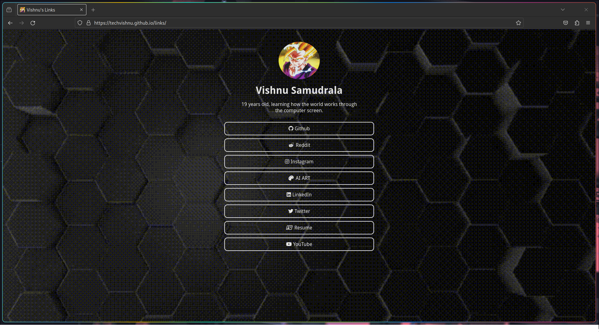

# Demo




# Install

First, clone the file with the following command. Then apply the [component](https://github.com/ardacarofficial/links-website/wiki/Component-Settings "component") and [design](https://github.com/ardacarofficial/links-website/wiki/Design-Settings "design") settings. You can check the [wiki](https://github.com/ardacarofficial/links-website/wiki "wiki") for help.

```sh
git clone https://github.com/techvishnu/links.git
```

You can then upload your files to any hosting.

# Note

Contributions are what make the open source community a great place to learn, inspire and create. Your contributions are greatly appreciated.

If you have a suggestion to make this better, please fork the repository and create a pull request. You can also open an issue with the "Development" tag. If you want, you can also share it in the [discussions](https://github.com/ardacarofficial/links-website/discussions/ "discussions") section. Don't forget to give stars to the project!

# License
Distributed under the MIT license.
